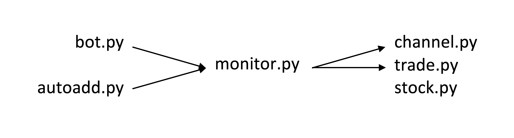

# Анализ биржи криптовалюты (CryptoAnalysis)

Источник | Ссылка
---|---
Канал Telegram | [@cryptosovet](https://t.me/cryptosovet)
Бот Telegram | [@CryptoSovetBot](https://t.me/CryptoSovetBot)


Биржи
---
№ | Биржа | GitHub | API
---|---|---|---
0 | [YoBit](https://yobit.net/ru/wallets/) | [NanoBjorn](https://github.com/NanoBjorn/yobit) | [yobit.net](https://yobit.net/ru/api/)
1 | [Bittrex](https://bittrex.com/Balance) | [EricSomdahl](https://github.com/ericsomdahl/python-bittrex) | [bittrex.com](https://bittrex.com/Home/Api)
2 | [Poloniex](https://poloniex.com/) | [s4w3d0ff](https://github.com/s4w3d0ff/python-poloniex) | [poloniex.com](https://poloniex.com/support/api/)

Схема работы
---
``` pip install -r requirements.txt ```

Операция | Mac | Linux | Windows
---|---|---|---
Настройка | ```  ``` | ``` wget https://bootstrap.pypa.io/get-pip.py ``` <br> ``` sudo python3 get-pip.py ``` <br> ``` pip install vk_api bs4 matplotlib pymongo ``` <br> ``` sudo apt-get install python3-tk python-tk -y ``` <br> ``` pip install PyTelegramBotAPI==2.2.3 ``` <br> ``` lsof -i:27017 ``` <br> ``` sudo apt-get install mongodb ``` <br> ``` sudo service mongodb start ``` <br> ``` tail -n200 /var/log/mongodb/mongodb.log ``` <br> ``` git clone https://github.com/kosyachniy/crypto ``` <br> ``` ... ``` <br> ``` ... ``` <br> ``` tmux ``` <br> ``` cd crypto ``` | ```  ```
Запуск | ``` mongod ``` <br> ``` ./main ``` | ``` ./main ``` | ```  ```



Отсутствующие файлы
---
Номер | Имя | Цель
---|---|---
1 | ``` data/set.txt ``` | Основные настройки
2 | ``` data/keys.txt ``` | Ключи
3 | ``` data/*.session ``` | Сессии пользователей Telegram

Сделать
---
2. Определние объёма
4. Только продажа без покупки
6. ??? Временной промежуток между ордерами одной валюты
7. Сделать очереди в мультипроцессинге чтобы библиотеки могли работать
9. Понижать ордеры на долгосроках
10. Запуск из одного файла - multiprocessing
11. Синхронизация и бэкап данных
13. ICO
14. ??? Не покупать, если слишком маленький объём и это не памп
15. Отправляет информацию о биржах всем при личном запросе
16. Возвращать с бирж количество сколько купили валюты
18. На пампах сделать кнопку выхода
19. ??? Перенести продажу в модуль автотрейдинга
23. Автоматическое определние курса продажи в пампах (закрытие первой волны)
24. Сохранение предыдущих цен валют на биржах для рассчёта роста - падения
25. Разделение сигналов по тегам
26. Ошибка, когда в боте нажимаешь несколько раз "Информация"
27. Сделать в боте проверку курсов валют и получение графиков
28. Несколько раз присылает информацию с бирж в временной промежуток
29. Ошибка при чтении из бота на долгом времени
31. При ценовом диапозоне выбирать наибольшую цену
34. Добавление новых валют
35. Проверить дробные проенты в сигналах
36. Временное ограничение для сигналов 5, 13, 18 часов минус 1% ордера +1% стоп-лосс
37. Завышенные проценты на privatesignals
39. Автоматическая докупка маленькой валюты, чтобы продать
40. Ошибка с API YoBit

Временные фиксы
---
1. Основная валюта - биткоины, всё выражается через неё, использование символики по умолчанию
2. Не распознаёт сигналы с несколькими валютами
3. Не разделяет сигналы с несколькими покупками
5. Фиксированная цена закупки
4. Покупает по цене на бирже, а не установленной в сигнале
6. Так как на биржу YoBit отправляется nonce по времени, очень быстрые операции не проходят<br>Стоит замедление
7. В канал выкладывает общий курс с битрекса

Модули
---
Управление ботом
1. Кнопки
2. Пампы
3. Информация
4. Настройки
5. Сигналы
вход: Telegram сообщения
выход: файл с сообщениями / запуск под функций

Обработка сигналов
1. Однострочные, двухструнные мои
2. Многострочные мои
3. Выделение построчное
4. Замена на стандартную информацию
вход: файл с сообщениями
выход: выделенная информация в БД

Ведение канала
1. Форматирование информации
вход: выделенная информация в БД
выход: канал Telegram

Определение параметров для бирж
1. Рассчёт основных параметров для соответствующей биржи
вход: выделенная информация в БД
выход: операции на бирже в БД

v перенести покупку сюда v

Биржа
1. Выставление покупки
2. Стоп-лоссы
3. Контроль исполнения
4. Выставление продажи
вход: операции на бирже в БД
выход: ордеры на биржах

Пампы
1. Быстрое выставление нужных параметров
вход: валюта и биржа
выход: ордеры на биржах

x убрать этот модуль в функционал x

Информация
1. Вывод основной информации
выход: сообщения Telegram
